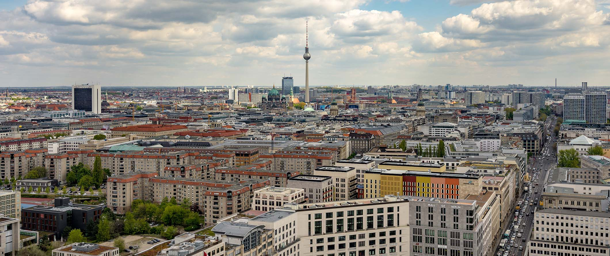

# Price-Suggestion-AirBNB-Berlin
# AirBNB Berlin

## Background Information 

Berlin is one of the most favourable city to visit in Europe. There are lot of tourist attractions , not only for adults, but also for children. AirBNB want therefore expanding business by targeting not only family segment, but also groups (each includes 3 people or more). Assuming that, family/group spend more than solo traveler, it is possibly good chance to bring company more capital. it is an excitement and real good opportunity as well to figure out more about it.

## Problem Statement

In order to optimizing business expansion process, it is bigger size of accommodation needed to fulfil long holiday school. At least entire room of apartment are demanded to fulfil this criteria. Entire House for Holiday Staycation are better and more suitable for modern big family, meanwhile for smaller family/group, entire apartament should be fine.

## Business Question

- In which areas are the most potential to be grown this business?
- Are these selected features affecting the accommodation price?
- Which type of room are most to be found in each neighbourhood group?
- Is the neighbourhood of the most expensive accommodation located in the same as its neighbourhood group (district) ?
- Does the sightseeing area have impact on the price and accommodations distribution?

## Business Goals

- Giving advices to our business development team to grow our business in favorable area hence with good price.
- Building a model to suggest accommodation price in best suitable district (neighbourhood group) for upcoming accommodation.

### **By analyzing publicly available information about a city's Airbnb's listings, Inside Airbnb provides filters and key metrics so you can see how Airbnb is being used to compete with the residential housing market.**

The data behind the Inside Airbnb site is sourced from publicly available information from the Airbnb site.

Data Source: http://insideairbnb.com/get-the-data.html

## Biggest Credit to

1. God Almighty

2. Mi Padre, mi Madre, & mi Familia

3. My mentor Mas Khumaeni (best mentor ever)

4. My fellow Purwadhika brothers & sisters 

5. Keith Galli

6. Krish Naik

7. Etc.
